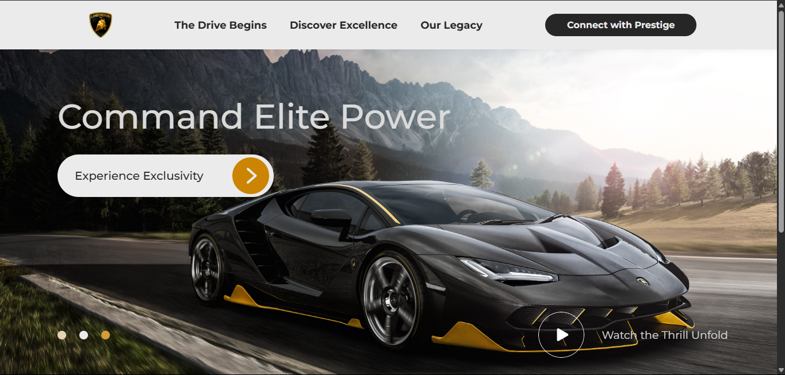

# Lamborghini Aventador Showcase

An immersive web experience featuring high-quality visuals, interactive elements, and a sleek design to showcase the Lamborghini Aventador.



## 🚀 Features
- Dynamic background switching between images and video
- Smooth animations with AOS (Animate On Scroll)
- Interactive 3D model integration using Three.js
- Responsive and modern UI with React.js
- Optimized for performance and SEO

## 🛠️ Technologies Used
- React.js
- React Router
- AOS (Animate On Scroll)
- Vercel (Deployment)
- HTML, CSS, JavaScript

## 📂 Project Structure
```
/project-root
│── src/
│   │── assets/   # Images & videos
│   │── components/  # React components
│   │── pages/  # Page components
│── public/
│── package.json
│── README.md
```

## 🔧 Installation
1. Clone the repository:
   ```sh
   git clone https://github.com/jpedromergulhao/lamborghini-aventador.git
   ```
2. Navigate to the project folder:
   ```sh
   cd lamborghini-aventador
   ```
3. Install dependencies:
   ```sh
   npm install
   ```
4. Start the development server:
   ```sh
   npm run dev
   ```

## 🌎 Live Demo
Check out the live version: [Lamborghini Aventador Showcase](https://lamborghini-aventador.vercel.app/)

---

